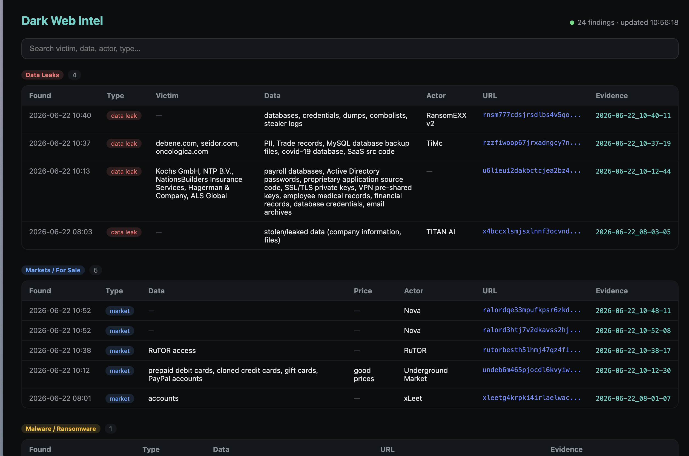

<div align="center">

# 🕸️ darkweb-intel

### Autonomous Dark-Web Threat Intelligence Platform

*Crawls .onion sites over Tor, reads each page with a local LLM, and surfaces structured threat intel on a live dashboard — fully self-hosted, no data ever leaves the box.*

<br>


</div>

---

## 📸 The Dashboard

Live findings, auto-categorized and sorted by threat type — data leaks, markets, malware, fraud, and more.

<div align="center">



</div>

---

## ⚡ What It Does

`darkweb-intel` is a **24/7 autonomous intelligence pipeline**. You point it at a few seed directories; it does the rest:

- 🧭 **Discovers** new .onion sites on its own by scoring and following links it finds
- 🧅 **Crawls** every site anonymously through the Tor network
- 🧠 **Reads** each page with a local LLM that extracts *who, what, and how much* — victim, data, price, threat actor
- 🗂️ **Categorizes** findings into a fixed taxonomy: `data leak · market · fraud · malware · hacking service · forum`
- 🔁 **Deduplicates** by URL and detects mirror sites so nothing is counted twice
- 📊 **Displays** everything on a live, searchable dashboard with screenshot evidence for every finding

> **🔒 Privacy by design:** the AI runs *locally* via Ollama. Page content is analyzed entirely on the server — nothing is ever sent to a third-party API.

---

## 🏗️ Architecture

```
   ┌──────────────┐
   │ targets.txt  │   manual seed URLs (you curate these)
   └──────┬───────┘
          │ seed
          ▼
                    ┌──────────────┐
   cron (every 4h)  │  producer.py │   seeds frontier from targets.txt + page_state,
   ───────────────► │   (router)   │   then drains the top-scored URLs into the queue
                    └──────┬───────┘
                           │ enqueue (up to 200/run)
                           ▼
                    ┌──────────────┐
                    │  Redis queue │   "scrape" jobs waiting
                    └──────┬───────┘
                           │ pull
              ┌────────────┼────────────┐
              ▼            ▼            ▼
        ┌─────────┐  ┌─────────┐  ┌─────────┐
        │ worker1 │  │ worker2 │  │ worker3 │   always-on systemd services
        └────┬────┘  └────┬────┘  └────┬────┘
             └────────────┼────────────┘
                          ▼
   ┌──────────────────────────────────────────────┐
   │  For each page:                              │
   │   1. 🧅 scrape via Tor (Playwright)          │
   │   2. 🧠 analyze with local LLM (Ollama)      │
   │   3. 🔁 dedup + mirror check                 │
   │   4. 💾 upsert finding → Postgres            │
   │   5. 🧭 discover links → score → frontier    │
   └───────────────────────┬──────────────────────┘
                           ▼
                    ┌──────────────┐
                    │ dashboard.py │   Flask · live polling · evidence viewer
                    │  :8000       │
                    └──────────────┘
```

**The discovery loop is the clever part.** Instead of crawling a fixed list, the system maintains a **scored frontier** (a Redis sorted set). Brand-new domains score high, already-seen pages score low, pagination traps score negative. The router always pulls the most promising unexplored ground first — so it keeps finding *fresh* sites on its own.

---

## 🧰 Tech Stack

| Layer | Tool | Why |
|-------|------|-----|
| **Anonymity** | Tor (self-built Alpine container) | Anonymous .onion access |
| **Crawling** | Playwright (headless Chromium) | Renders JS-heavy dark-web pages |
| **AI reading** | Ollama + `llama3.1:8b` | Local categorization — no data leaves the host |
| **Queue** | Redis | Decouples discovery from scraping |
| **Workers** | RQ + systemd | 3 always-on parallel crawlers |
| **Storage** | PostgreSQL 16 | Findings, page state, crawl graph |
| **Dashboard** | Flask | Live findings + screenshot evidence |
| **Scheduling** | cron | Kicks off the router every 4 hours |

All infrastructure runs in Docker, bound to `127.0.0.1` and viewed through an SSH tunnel — nothing is exposed to the public internet.

---

## 📂 Project Layout

```
darkweb-intel/
├── scripts/
│   ├── producer.py      # router: scores frontier + queues targets
│   ├── worker.py        # scrape → analyze → dedup → store → discover
│   ├── scraper.py       # Playwright-over-Tor page capture
│   ├── ai_reader.py     # local LLM categorization (closed taxonomy + relevance gate)
│   ├── discovery.py     # frontier scoring + seen/mirror tracking
│   ├── normalize.py     # canonical URL form (kills duplicates)
│   └── dashboard.py     # Flask dashboard + evidence API
├── captures/            # per-page evidence (screenshot + text + metadata)
├── filters/             # pre-retrieval safety keyword filters
├── targets.txt          # manual seed directories (you curate these)
├── docker-compose.yml   # tor · postgres · redis
└── docs/
    └── dashboard.png
```

---

## 🗃️ Data Model

Three tables keep the whole thing honest:

- **`findings`** — one clean row per site (`type`, `victim`, `data`, `price`, `threat_actor`, `url`, evidence folder, content hash). A `UNIQUE(url)` index plus an upsert that *freezes* the category unless the page content actually changes — no flickering tags.
- **`page_state`** — per-page content hash + link count. Lets the crawler skip the LLM on pages that haven't changed.
- **`links`** — the crawl graph (`src → dst`). Powers in-degree scoring so popular sites get prioritized.

---

## 🚀 Running It

> Built and operated on a single Ubuntu 24.04 VPS. The infra containers stay up; the workers do the crawling.

**Start the engine**
```bash
# queue the best targets from the frontier
python3 scripts/producer.py

# the 3 workers (always running) pick up jobs and crawl
sudo systemctl start darkweb-worker@{1,2,3}
```

**Watch it work**
```bash
sudo journalctl -u 'darkweb-worker@*' -f
```

**See the findings**
```bash
# open an SSH tunnel, then visit http://localhost:8000
ssh -L 8000:localhost:8000 user@your-server
```

**Check status**
```bash
# how many findings, by category?
docker compose exec postgres psql -U intel -d darkweb \
  -c "SELECT type, count(*) FROM findings GROUP BY type ORDER BY count DESC;"
```

---

## 🛡️ Safety & Ethics

This is a **defensive research** tool, built with hard boundaries:

- ✅ **Passive collection only** — reads public listings; never logs in, solves CAPTCHAs, or creates accounts
- ✅ **No contraband stored** — keeps metadata and hashes, never leaked databases, PII, or live malware files
- ✅ **Pre-retrieval filtering** — links are screened against keyword blocklists *before* anything is fetched
- ✅ **Isolated & local** — runs in containers bound to localhost; the AI never phones home

The goal is to understand the dark-web threat landscape the way a SOC or threat-intel analyst would — not to participate in it.

---

<div align="center">

**Built for hands-on threat-intelligence research.**

*Tor · Local LLMs · Autonomous discovery · Evidence-backed findings*

</div>
